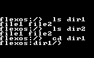

# OS-CSD

## Introduction
This repo consists of multiple modules.

1. Miniature version of the map using simple arrays
2. Heap and process memory allocation using a linked list ( the memory allocated for this is 
not allocated in the own heap but rather in a small chunk of memory at end the of the disk space)
(See main readme for more details)
3. Image generator
4. Memory visualizer
5. Keyboard adapter
6. File watcher

> Syntaxes are limited to our own language and not C++ or C

## Map
The map is a miniature version using simple arrays. This supports the following functions

1. Insert
2. Delete
3. Search
4. Display

> Each individual component is unit-tested using the `map_test.c` file

# Random Number Generator
This is a random number generator that uses the linear congruential method to generate random numbers.
We also used a random engine to introduce randomness in the seed value.

The formula is as follows

setting seed
```
rand_engine = (((seed | rand_engine) * 7621) + 1) % 32768;
rand_lfsr = rand_engine;
```

generating random number
```
rand_bit = ((rand_lfsr >> 0) ^ (rand_lfsr >> 2) ^ (rand_lfsr >> 3) ^ (rand_lfsr >> 5)) & 1;
rand_lfsr = (rand_lfsr >> 1) | (rand_bit << 15);

rand_number = rand_lfsr % 100;
```

> Sample output for this random number generator is in the file `random_number_generator_output.txt`

## How to evaluate random number generator
I used an approach similar to the chi-square test to evaluate the random number generator. I generated 1000 random numbers and then divided them into their own bucket (we can optimize by allocating a single bucket for 10 values ).

Then I calculated the expected value for each bucket and then calculated the chi-square value for each bucket. Then I summed up all products of chi-square and the difference between the running and old values. We ideally want the graph to be as straight as possible. The graph for this random number generator is as follows

> Note: The aspect ratio of the images is preserved and also while maintaining the screen size to be 16x16 (translates to 128x128 pixels on our screen)

> The trace files used for this are in the folder `./traces`


## About other scripts

###  Image generator

This script is used to generate the array in the c structure for the face image. This script looks into all the images in the folder `./images` and then generates the array in c structure in dimension 128*16(translates to `128x128` pixels in our screen). This is then used in the file `face_{}.h` to display the face. The display driver has an inbuilt function to display the face. The output image and c structure array generated are in folder `./out`.

##### Example output
> Input image


> Final image


> C structure array
```c
char font_0[128][16] = {
	{0, 0, 0, 0, 0, 0, 0, 0, 0, 0, 0, 0, 0, 0, 0, 0},
	{0, 0, 0, 0, 0, 0, 0, 0, 0, 0, 0, 0, 0, 0, 0, 0},
	{0, 0, 0, 0, 0, 0, 0, 0, 0, 0, 0, 0, 0, 0, 0, 0},
	{0, 0, 0, 0, 0, 0, 0, 0, 0, 0, 0, 0, 0, 0, 0, 0},
	{0, 0, 0, 124, 0, 0, 0, 0, 0, 0, 0, 0, 0, 0, 0, 0},
	{0, 0, 0, 199, 0, 0, 0, 0, 0, 0, 0, 0, 0, 0, 0, 0},
	{0, 0, 224, 128, 1, 0, 0, 0, 0, 0, 0, 0, 0, 0, 0, 0},
	{0, 0, 32, 0, 7, 0, 0, 0, 0, 0, 0, 0, 0, 0, 0, 0},
	{0, 0, 32, 0, 4, 0, 0, 0, 0, 0, 0, 0, 0, 0, 0, 0},
	{0, 0, 224, 0, 8, 60, 0, 0, 0, 0, 0, 0, 0, 0, 0, 0},
	{0, 0, 128, 1, 240, 195, 0, 0, 0, 0, 0, 0, 0, 0, 0, 0},
	{0, 0, 0, 3, 0, 128, 0, 0, 0, 0, 0, 0, 0, 0, 0, 0},
	{0, 0, 0, 2, 0, 128, 0, 0, 0, 0, 0, 0, 0, 0, 0, 0},
	{0, 0, 0, 3, 0, 64, 0, 0, 0, 0, 0, 0, 0, 0, 0, 0},
	{0, 0, 0, 241, 255, 64, 0, 0, 0, 0, 0, 0, 0, 0, 0, 0},
	{0, 0, 128, 136, 148, 96, 0, 0, 0, 0, 0, 0, 0, 0, 0, 0},
	{0, 0, 128, 248, 99, 48, 0, 0, 0, 0, 0, 0, 0, 0, 0, 0},
	{0, 0, 128, 0, 0, 8, 0, 0, 0, 0, 0, 0, 0, 0, 0, 0},
	{0, 0, 128, 0, 0, 4, 0, 0, 0, 0, 0, 0, 0, 0, 0, 0},
	{0, 0, 128, 0, 28, 8, 0, 0, 0, 0, 0, 0, 0, 0, 0, 0},
	{0, 0, 0, 129, 5, 8, 0, 0, 0, 0, 0, 0, 0, 0, 0, 0},
	{0, 0, 0, 131, 14, 24, 0, 0, 0, 0, 0, 0, 0, 0, 0, 0},
	{0, 0, 0, 14, 1, 16, 0, 0, 0, 0, 0, 0, 0, 0, 0, 0},
	{0, 0, 0, 24, 30, 23, 0, 0, 0, 0, 0, 0, 0, 0, 0, 0},
	{0, 0, 0, 0, 97, 9, 0, 0, 0, 0, 0, 0, 0, 0, 0, 0},
	{0, 0, 0, 48, 33, 2, 0, 0, 0, 0, 0, 0, 0, 0, 0, 0},
	{0, 0, 0, 8, 125, 2, 0, 0, 0, 0, 0, 0, 0, 0, 0, 0},
	{0, 0, 0, 4, 137, 2, 0, 0, 0, 0, 0, 0, 0, 0, 0, 0},
	{0, 0, 0, 4, 248, 4, 0, 0, 0, 0, 0, 0, 0, 0, 0, 0},
	{0, 0, 0, 244, 3, 24, 0, 0, 0, 0, 0, 0, 0, 0, 0, 0},
	{0, 0, 0, 166, 24, 96, 0, 0, 0, 0, 0, 0, 0, 0, 0, 0},
	{0, 0, 0, 178, 19, 192, 1, 0, 0, 0, 0, 0, 0, 0, 0, 0},
	{0, 0, 0, 2, 16, 95, 3, 0, 0, 0, 0, 0, 0, 0, 0, 0},
	{0, 0, 0, 193, 19, 73, 2, 0, 0, 0, 0, 0, 32, 0, 0, 0},
	{0, 0, 192, 12, 0, 255, 3, 0, 0, 0, 0, 0, 255, 0, 0, 0},
	{0, 0, 64, 112, 207, 128, 1, 0, 0, 0, 0, 0, 129, 0, 0, 0},
	{0, 0, 32, 0, 208, 131, 0, 0, 0, 0, 0, 192, 17, 1, 0, 0},
	{0, 0, 48, 224, 31, 128, 0, 0, 0, 0, 0, 32, 38, 3, 0, 0},
	{0, 0, 24, 32, 168, 133, 0, 0, 0, 0, 0, 16, 20, 4, 0, 0},
	{0, 0, 12, 160, 40, 154, 0, 0, 0, 0, 0, 152, 29, 4, 0, 0},
	{0, 0, 6, 96, 208, 3, 3, 0, 0, 0, 0, 12, 2, 4, 0, 0},
	{0, 0, 2, 128, 118, 0, 12, 0, 0, 48, 0, 3, 6, 3, 0, 0},
	{0, 254, 1, 0, 74, 0, 56, 0, 0, 24, 0, 0, 192, 0, 0, 0},
	{0, 2, 0, 0, 38, 184, 193, 0, 0, 40, 0, 1, 104, 0, 0, 0},
	{0, 3, 0, 0, 28, 40, 16, 127, 0, 36, 0, 1, 50, 0, 0, 0},
	{0, 1, 0, 0, 64, 56, 83, 192, 0, 72, 248, 25, 19, 0, 0, 0},
	{128, 1, 0, 0, 128, 3, 0, 128, 3, 136, 7, 0, 9, 0, 0, 0},
	{0, 3, 254, 15, 112, 5, 0, 0, 28, 8, 0, 124, 8, 0, 0, 0},
	{0, 2, 2, 10, 16, 8, 0, 48, 224, 231, 112, 128, 8, 0, 0, 0},
	{0, 2, 254, 15, 120, 8, 0, 48, 0, 144, 15, 4, 8, 0, 0, 0},
	{0, 2, 0, 0, 12, 4, 0, 32, 0, 16, 240, 219, 9, 0, 0, 0},
	{0, 4, 0, 0, 0, 4, 0, 48, 30, 112, 140, 16, 4, 0, 0, 0},
	{0, 8, 0, 0, 128, 7, 0, 208, 82, 0, 4, 212, 4, 0, 0, 0},
	{0, 8, 0, 0, 132, 248, 7, 24, 62, 96, 248, 7, 4, 0, 0, 0},
	{0, 144, 3, 0, 148, 3, 116, 8, 0, 49, 0, 100, 4, 0, 0, 0},
	{0, 144, 0, 0, 28, 5, 192, 11, 224, 19, 0, 86, 4, 0, 0, 0},
	{0, 208, 15, 0, 0, 9, 64, 10, 33, 57, 0, 35, 3, 0, 0, 0},
	{252, 31, 24, 0, 0, 6, 0, 200, 34, 36, 128, 129, 0, 0, 0, 0},
	{6, 0, 16, 4, 0, 0, 0, 78, 194, 32, 128, 74, 0, 0, 0, 0},
	{8, 0, 16, 4, 0, 0, 128, 69, 195, 78, 128, 74, 0, 0, 0, 0},
	{6, 0, 32, 6, 28, 0, 32, 188, 112, 65, 128, 75, 0, 0, 0, 0},
	{12, 244, 199, 2, 244, 255, 161, 3, 0, 66, 0, 72, 0, 0, 0, 0},
	{24, 3, 5, 1, 68, 2, 1, 0, 64, 2, 0, 80, 0, 0, 0, 0},
	{224, 240, 7, 1, 248, 253, 1, 0, 0, 250, 0, 80, 0, 0, 0, 0},
	{16, 3, 0, 1, 0, 0, 0, 224, 231, 128, 0, 80, 0, 0, 0, 0},
	{192, 0, 7, 1, 0, 0, 0, 128, 36, 128, 0, 96, 0, 0, 0, 0},
	{48, 0, 133, 1, 0, 0, 0, 192, 255, 224, 0, 0, 0, 0, 0, 0},
	{96, 0, 133, 12, 56, 0, 254, 95, 0, 88, 0, 0, 0, 0, 0, 0},
	{64, 0, 133, 8, 8, 6, 10, 41, 0, 14, 0, 0, 0, 0, 0, 0},
	{192, 0, 133, 118, 56, 5, 254, 59, 0, 227, 1, 0, 0, 0, 0, 0},
	{128, 129, 133, 130, 7, 7, 5, 0, 0, 1, 0, 0, 0, 0, 0, 0},
	{0, 251, 68, 1, 0, 0, 5, 134, 15, 1, 0, 0, 0, 0, 0, 0},
	{0, 4, 68, 1, 0, 0, 135, 130, 8, 1, 0, 0, 0, 0, 0, 0},
	{0, 0, 116, 0, 0, 0, 133, 130, 15, 1, 0, 0, 0, 0, 0, 0},
	{0, 0, 36, 0, 0, 0, 197, 2, 128, 1, 0, 0, 0, 0, 0, 0},
	{0, 0, 52, 252, 0, 0, 37, 6, 240, 0, 0, 0, 0, 0, 0, 0},
	{0, 0, 2, 4, 151, 123, 225, 4, 12, 0, 0, 0, 0, 0, 0, 0},
	{0, 0, 4, 252, 152, 72, 14, 3, 4, 0, 0, 0, 0, 0, 0, 0},
	{0, 0, 4, 0, 0, 184, 137, 48, 6, 0, 0, 0, 0, 0, 0, 0},
	{0, 0, 4, 0, 64, 32, 196, 41, 3, 0, 0, 0, 0, 0, 0, 0},
	{0, 0, 4, 0, 160, 0, 70, 133, 1, 0, 0, 0, 0, 0, 0, 0},
	{0, 0, 4, 0, 160, 255, 48, 194, 0, 0, 0, 0, 0, 0, 0, 0},
	{0, 0, 4, 0, 144, 42, 145, 98, 0, 0, 0, 0, 0, 0, 0, 0},
	{0, 0, 8, 0, 212, 255, 189, 50, 0, 0, 0, 0, 0, 0, 0, 0},
	{0, 0, 8, 0, 84, 0, 37, 24, 0, 0, 0, 0, 0, 0, 0, 0},
	{0, 0, 8, 0, 54, 112, 61, 12, 0, 0, 0, 0, 0, 0, 0, 0},
	{0, 0, 8, 64, 49, 142, 1, 7, 0, 0, 0, 0, 0, 0, 0, 0},
	{0, 0, 8, 48, 16, 106, 0, 1, 0, 0, 0, 0, 0, 0, 0, 0},
	{0, 0, 8, 22, 176, 13, 0, 1, 0, 0, 0, 0, 0, 0, 0, 0},
	{0, 0, 16, 2, 16, 1, 128, 1, 0, 0, 0, 0, 0, 0, 0, 0},
	{0, 0, 16, 3, 176, 1, 112, 0, 0, 0, 0, 0, 0, 0, 0, 0},
	{0, 0, 48, 2, 60, 0, 8, 0, 0, 0, 0, 0, 0, 0, 0, 0},
	{0, 0, 32, 1, 4, 0, 15, 0, 0, 0, 0, 0, 0, 0, 0, 0},
	{0, 0, 32, 0, 4, 128, 1, 0, 0, 0, 0, 0, 0, 0, 0, 0},
	{0, 0, 64, 0, 4, 128, 0, 0, 0, 0, 0, 0, 0, 0, 0, 0},
	{0, 0, 192, 0, 252, 191, 0, 0, 0, 0, 0, 0, 0, 0, 0, 0},
	{0, 0, 128, 0, 164, 132, 0, 0, 0, 0, 0, 0, 7, 0, 0, 0},
	{0, 0, 128, 248, 251, 191, 0, 0, 0, 0, 0, 0, 117, 0, 0, 0},
	{0, 0, 0, 33, 10, 128, 0, 0, 0, 0, 0, 128, 84, 0, 0, 0},
	{0, 0, 0, 249, 9, 128, 0, 0, 0, 0, 0, 128, 114, 0, 0, 0},
	{0, 0, 0, 1, 184, 128, 0, 0, 0, 0, 0, 128, 2, 0, 0, 0},
	{0, 0, 0, 1, 192, 0, 1, 0, 0, 0, 0, 128, 2, 0, 0, 0},
	{0, 0, 0, 2, 128, 1, 1, 0, 0, 0, 0, 128, 58, 0, 0, 0},
	{0, 0, 0, 2, 64, 33, 1, 0, 0, 0, 0, 128, 42, 0, 0, 0},
	{0, 112, 0, 2, 96, 152, 1, 0, 0, 0, 0, 128, 59, 0, 0, 0},
	{0, 80, 0, 4, 160, 135, 0, 0, 0, 0, 0, 128, 2, 0, 0, 0},
	{0, 48, 0, 12, 0, 192, 0, 0, 0, 0, 0, 128, 3, 0, 0, 0},
	{0, 128, 0, 152, 28, 64, 0, 0, 0, 0, 0, 128, 2, 0, 0, 0},
	{0, 128, 0, 144, 23, 64, 0, 0, 0, 0, 0, 0, 2, 0, 0, 0},
	{0, 96, 3, 144, 20, 64, 0, 0, 0, 0, 0, 64, 3, 0, 0, 0},
	{0, 0, 58, 32, 228, 77, 0, 0, 0, 0, 0, 64, 1, 0, 0, 0},
	{0, 32, 42, 32, 8, 84, 0, 0, 0, 0, 0, 192, 1, 0, 0, 0},
	{0, 224, 57, 64, 196, 73, 0, 0, 0, 0, 0, 0, 0, 0, 0, 0},
	{0, 64, 1, 64, 8, 96, 0, 0, 0, 0, 0, 0, 0, 0, 0, 0},
	{0, 192, 1, 64, 16, 16, 0, 0, 0, 0, 0, 0, 0, 0, 0, 0},
	{0, 0, 0, 128, 20, 8, 0, 0, 0, 0, 0, 0, 7, 0, 0, 0},
	{0, 0, 0, 128, 28, 8, 0, 0, 0, 0, 0, 0, 5, 0, 0, 0},
	{0, 0, 0, 128, 20, 4, 0, 0, 0, 0, 0, 0, 115, 0, 0, 0},
	{0, 128, 3, 128, 20, 6, 0, 0, 0, 0, 0, 0, 72, 0, 0, 0},
	{0, 128, 2, 0, 145, 1, 0, 0, 0, 0, 0, 0, 64, 0, 0, 0},
	{0, 128, 4, 0, 147, 0, 0, 0, 0, 0, 0, 0, 8, 0, 0, 0},
	{0, 0, 5, 0, 198, 0, 0, 0, 0, 0, 0, 0, 0, 0, 0, 0},
	{0, 0, 7, 0, 124, 0, 0, 0, 0, 0, 0, 0, 64, 0, 0, 0},
	{0, 0, 0, 0, 0, 0, 0, 0, 0, 0, 0, 0, 160, 0, 0, 0},
	{0, 0, 0, 0, 0, 0, 0, 0, 0, 0, 0, 0, 160, 0, 0, 0},
	{0, 0, 0, 0, 0, 0, 0, 0, 0, 0, 0, 0, 224, 0, 0, 0},
	{0, 0, 0, 0, 0, 0, 0, 0, 0, 0, 0, 0, 0, 0, 0, 0},
	{0, 0, 0, 0, 0, 0, 0, 0, 0, 0, 0, 0, 0, 0, 0, 0}
};
```

### Memory visualizer

This is a simple memory visualizer which takes the memory dump and then displays the memory on the screen. The memory dump is in the file `./memory.txt`. The memory visualizer is the file `./memory_vis.cpp`. The output of the memory visualizer is in the file `./memory_out.txt`. The output is as follows

[link to memory output text file](./mem_vis/memory_out.txt)

> Here, we can see the complete image but only to look into the display segment of the memory segment, we have another script `./script/mem_conv.py` which takes the output of the memory visualizer and then displays the memory segment. The output of this is as follows



### File Watcher

The file watcher watches the memory in the core constantly until any error occurs. Once any change is made in the file, this watcher runs a shell script that runs all necessary commands to change the output in the final output display.

This file watcher is written in Golang.

We can also attach this watcher to the environment of the memory (ex. `./dev/faces`) which can affect the final output but presently it is confined only to the core `memory.txt`.
